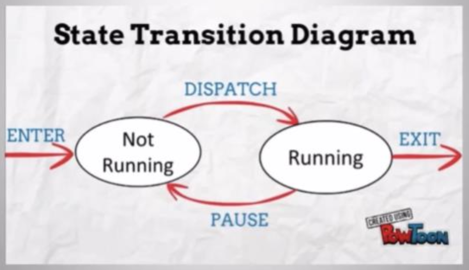
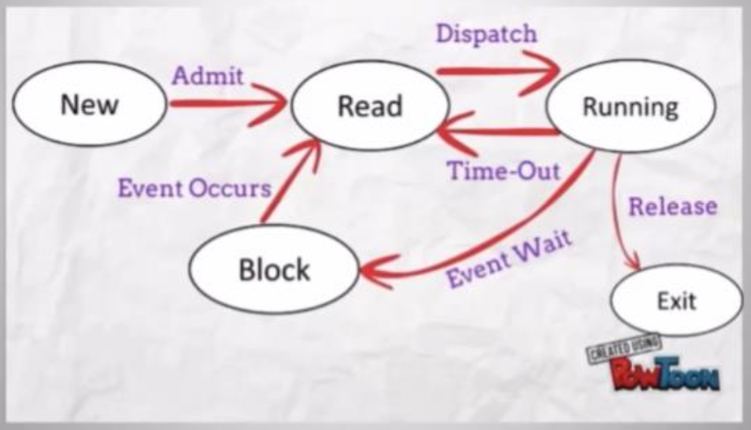
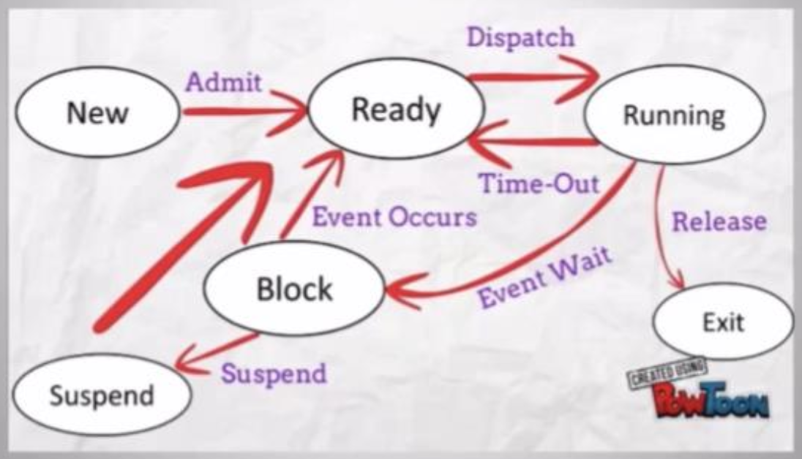
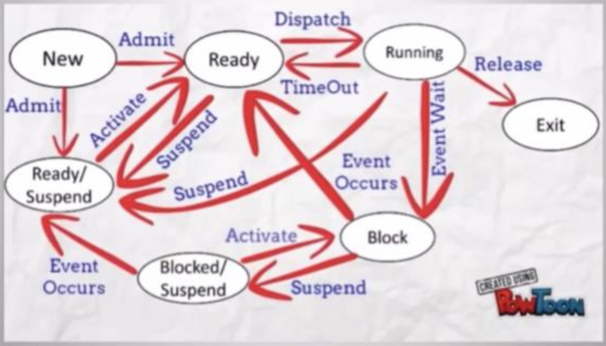

# Trạng thái của tiến trình trong video

Mỗi chương trình được thực hiện thông qua các câu lệnh thực thi nhờ vào hệ thống là kết thúc khi đã hoàn thành hoặc được thoát ra.

---
### 1. Mô hình tiến trình 2 trạng thái (Two states Process Model)

Tiến trình mới được tạo sẽ được đưa vào trạng thái Not Running, sau khi được cấp đủ tài nguyên thì sẽ chuyển sang trạng thái Running.

Thực thi hết câu lệnh thì tiến trình kết thúc (Exit).
Chưa thực thi hết mà hết thời gian thực thi hoặc phải chờ các input / output thì lại về trạng thái Not Running và tiếp tục vòng lặp trên

---
### 2. Mô hình tiến trình 5 trạng thái (Five states Process Model)

Các trạng thái:
* New: Vừa mới dược tạo mới nhưng chưa được đưa vào danh sách quản lý các process.
* Block: Process này chưa sẵn sàng để thực thi và phải chờ một sự kiện xảy ra, ví dụ như chờ tín hiệu từ IO.
* Ready: Process sãn sàng để được thực thi nếu đến lượt.
* Running: Đang được CPU thực thi.
* Exit: Process đã được giải phóng, không còn nằm trong danh sách quản lý các process.

Chuyển đối giữa các trạng thái:
* Tiến trình được khởi tạo ở trạng thái New và được đưa vào trạng thái Ready.
* Nếu được cung cấp đủ tài nguyên, tiến trình sẽ chuyển qua trạng thái Running.
* Thực hiện hết các câu lệnh, tiến trình sẽ được giải phóng và kết thúc tiến trình (Exit).
* Nếu hết thời gian thì lại về trạng thái Ready và nhường chỗ cho các tiến trình khác.
* Nếu phải đợi IO ở trạng thái Running thì tiến trình sẽ chuyển sang trạng thái Block. IO xong thì đưa về trạng thái Ready.
* Và tiếp tục lặp đến khi thực hiện xong các câu lệnh.

Nhưng vấn đề lại được đặt ra đối với mô hình 5 trạng thái này vì giữa CPU và các thiết bị vào ra (I/O Devices) có lỗi hỏng lớn là khi mà bộ điều phối quản lí các tiến trình khác thì có thể ảnh hưởng đến các vi xử lí khác, chúng có thể lãng phí, không làm vì đối với các multiprogramming.

### 3. Suspend State
Do đó mô hình suspend state được sinh ra để giải quyết vấn đề trên.

#### 3.1 One Suspend State

Cấu trúc mô hình khá giống với mô hình 5 trạng thái chỉ có thêm trạng thái treo (suspend) sau khi tiến trình quay về trạng thái Block thì sẽ không quay lại Ready luôn mà được dừng lại, các câu lệnh đã được thực hiện giữ nguyên và khi activate tiếp sẽ quay lại Ready và đợi lệnh từ vi xử lý để tiếp tục thực hiện các câu lệnh còn lại.

#### 3.2 Two Suspend State

* New -> Ready hoặc Ready/Suspend: khi khởi tạo một tiến trình (New) thì nó có thể đợi thêm vào ready quêu hoặc ready/suspend queue.

* Ready -> Running hoặc Ready/Suspend: một tiến trình mới sẵn sàng thực hiện câu lệnh được chuyển đến trạng thái Running, nếu như không nhận được tài nguyên cung cấp thì sẽ chuyển đến trạng thái Ready/Suspend.

* Ready/Suspend -> Ready: khi không có tiến trình nào đang ở trạng thái Ready thì tiến trình ở Ready/Suspend được ưu tiên chuyển về trạng thái Ready.

* Blocked -> Ready hoặc Blocked/Suspend: khi tiến trình sẵn sàng để thực hiện thì chuyển về trạng thái Ready. Nếu không có tiến trình sẵn sàng thì chuyển về Blocked/Suspend.

* Blocked / suspend ->Blocked hoặc Ready/Suspend: nếu như chỉ có một tiến trình ở Blocked/suspend queue và hệ điều hành phân tích thấy tiến trình sẽ được thực hiện sớm thì sẽ blocked process sẽ được chuyển vào bộ nhớ chính.